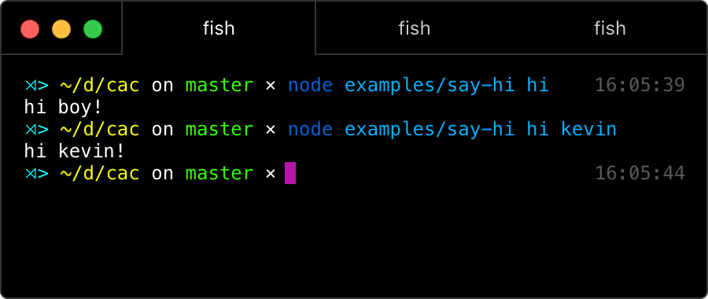
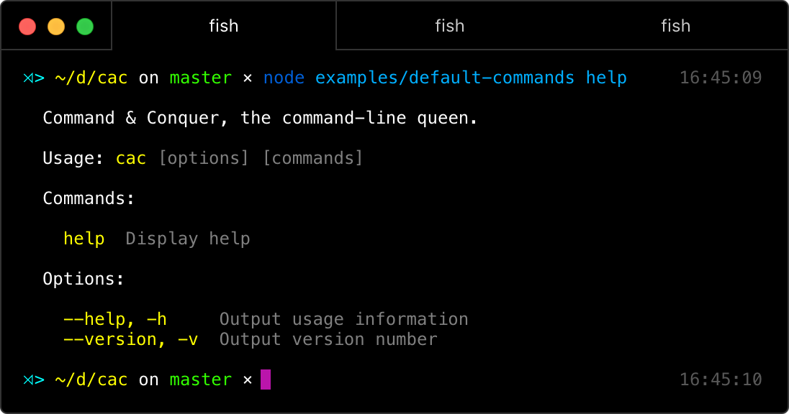

# cac [](https://npmjs.com/package/cac) [](https://npmjs.com/package/cac) [](https://circleci.com/gh/egoist/cac)

**C**ommand **A**nd **C**onquer, the queen living in your command line.


## Install

```bash
$ npm install --save cac
```

## Usage

```js
const cac = require('cac')

// initialize your cli program
const cli = cac()

// add your very first command
cli.command('hi', 'Say hi!', (input) => {
  console.log(`hi ${input[0] || 'boy'}!`)
})

// parse arguments and bootstrap
cli.parse()
```



### Default commands and options

- Options: `--help` `-h` `--version` `-v`
- Commands: `help`


 
## API

### .option(options, description, defaultValue)

- **options**: `string`, it could be `option` or `option, alias` or `alias, option`, the order does not matter. eg: `.option('install, i')`
- **description**: `string`, option description, will be used to output cli usage
- **defaultValue**: `any`, give a default value to this option

### .command(commands, description, fn)

- **commands**: `string`, it could be `command` or `command, alias` or `alias, command`, the order does not matter. eg: `.command('clone, c')`. It can also be a wildcard symbol `*`, which means always been triggered if no command was specified by user.
- **description**: `string`, command description, will be used to output cli usage
- **fn**: `function`, command function, will be triggered when this command matches user's input, the function takes two arguments:
  - *input*: non-flag arguments
  - *flags*: flags converted to camelCase

### .usage(text)

- **text**: `string`, the cli usage. default is `$bin [options] [commands]`

### .parse(argv)

- **argv**: `array`, default is `process.argv.slice(2)`

### .onError(handleError)

- **handleError**: `function`, triggered when your program throws an error or was rejected by a Promise call.

### .string(string | array)

a string or array of strings argument names to always treat as strings

### .boolean(boolean | string | array)

a boolean, string or array of strings to always treat as booleans. if true will treat all double hyphenated arguments without equal signs as boolean (e.g. affects --foo, not -f or --foo=bar)

### .example(text)

Add an example command for your command, will be shown in CLI usage.

## License

MIT © [egoist](https://github.com/egoist)
